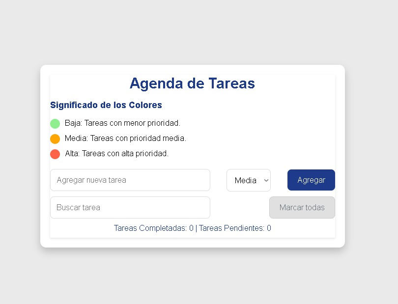

# 🗂️ Agenda de Tareas
## 📖 Descripción
Este proyecto es una **agenda de tareas** interactiva y sencilla para gestionar tus pendientes de manera eficiente. Permite agregar, filtrar y marcar tareas como completadas, además de mostrar un contador de tareas activas. Se han implementado diferentes niveles de prioridad con un sistema de colores para facilitar la identificación de las tareas más urgentes.

## 🌟 Características
- **Agregar tareas**: Introduce nuevas tareas con su descripción y asigna un nivel de prioridad.
- **Filtrar tareas**: Busca tareas por su contenido para encontrar rápidamente lo que necesitas.
- **Marcar como completadas**: Marca tareas como completadas y visualízalas de forma diferenciada.
- **Prioridades**: Tareas con colores para representar la prioridad (baja, media, alta).
- **Responsive design**: La interfaz se adapta a diferentes tamaños de pantalla, garantizando una experiencia óptima en dispositivos móviles y de escritorio.

## 📸 Imágenes


## 🛠️ Tecnologías utilizadas
<p align="center">
  <a href="https://developer.mozilla.org/es/docs/Web/JavaScript" target="_blank">
    
  </a>
  <a href="https://developer.mozilla.org/es/docs/Web/CSS" target="_blank">
    
  </a>
  <a href="https://developer.mozilla.org/es/docs/HTML/HTML5" target="_blank">
    
  </a>
</p>

- **HTML5**: Para la estructura del documento.
- **CSS3**: Para los estilos y diseño responsivo.
- **JavaScript**: Para la funcionalidad interactiva y manipulación de tareas.
- **SweetAlert**: Para mensajes emergentes.

## 🚀 Instalación y uso
### 1. Clona el repositorio a tu máquina local:
```bash
git clone https://github.com/tu-usuario/agenda-de-tareas.git
   ```
### 2. Navega a la carpeta del proyecto:
   ```bash
   cd agenda-de-tareas
   ```
### 3. Abre el archivo index.html en tu navegador para visualizar la aplicación.

## 🧑‍💻 Uso de la aplicación

- **Agregar tareas**: Introduce el texto de la tarea en el campo de entrada y selecciona la prioridad, luego haz clic en "Agregar".

- **Filtrar tareas**: Usa el campo de búsqueda para filtrar tareas por su descripción.

- **Marcar como completadas**: Haz clic en el checkbox junto a una tarea para marcarla como completada.

- **Visualizar prioridades**: Las tareas tienen indicadores de colores para reflejar la prioridad:
  - 🟢 **Baja**: Tareas con menor prioridad.
  - 🟡 **Media**: Tareas con prioridad media.
  - 🔴 **Alta**: Tareas con alta prioridad.

## 📂 Estructura de archivos
```bash
agenda-de-tareas/
├── index.html        # Archivo principal de la aplicación.
├── styles.css        # Hoja de estilos de la aplicación.
├── script.js         # Archivo JavaScript con la lógica de la aplicación.
├── logo.png          # Ícono de la aplicación.
├── screenshot.png    # Captura de pantalla de la aplicación.
```
